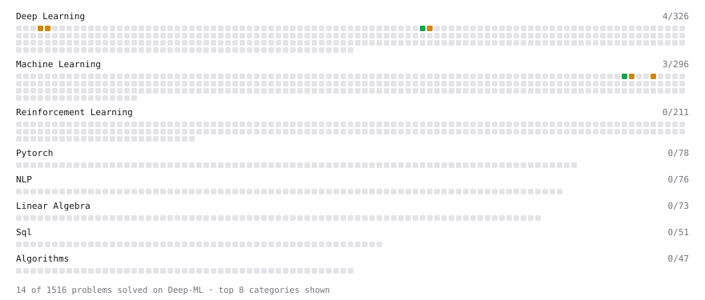

# Deep-ML

My machine learning practice from [Deep-ML](https://www.deep-ml.com). Every solution here was written by hand.

**11** solved · 11 problems · 0 labs · 0 math

[**Browse the interactive portfolio**](https://gucci639.github.io/deep-ml/) to replay this filling in over time.

## Problems

| | Difficulty | Solved | |
| --- | --- | --- | --- |
| [Derivative of a Polynomial](https://www.deep-ml.com/problems/116) | easy | 2026-06-29 | [solution](problems/0116-derivative-of-a-polynomial) |
| [Derivatives of Activation Functions](https://www.deep-ml.com/problems/217) | easy | 2026-07-01 | [solution](problems/0217-derivatives-of-activation-functions) |
| [Gradient Direction and Magnitude](https://www.deep-ml.com/problems/308) | easy | 2026-06-29 | [solution](problems/0308-gradient-direction-and-magnitude) |
| [Chain Rule for Composite Functions](https://www.deep-ml.com/problems/214) | medium | 2026-06-30 | [solution](problems/0214-chain-rule-for-composite-functions) |
| [Compute the Hessian Matrix](https://www.deep-ml.com/problems/218) | medium | 2026-07-01 | [solution](problems/0218-compute-the-hessian-matrix) |
| [Derivative of Cross-Entropy Loss w.r.t. Logits](https://www.deep-ml.com/problems/220) | medium | 2026-07-01 | [solution](problems/0220-derivative-of-cross-entropy-loss-w-r-t-logits) |
| [Derivative of Softmax](https://www.deep-ml.com/problems/219) | medium | 2026-07-01 | [solution](problems/0219-derivative-of-softmax) |
| [Jacobian Matrix Calculation](https://www.deep-ml.com/problems/202) | medium | 2026-06-30 | [solution](problems/0202-jacobian-matrix-calculation) |
| [Partial Derivatives of Multivariable Functions](https://www.deep-ml.com/problems/215) | medium | 2026-06-30 | [solution](problems/0215-partial-derivatives-of-multivariable-functions) |
| [Product Rule for Derivatives](https://www.deep-ml.com/problems/309) | medium | 2026-06-29 | [solution](problems/0309-product-rule-for-derivatives) |
| [Quotient Rule for Derivatives](https://www.deep-ml.com/problems/312) | medium | 2026-06-29 | [solution](problems/0312-quotient-rule-for-derivatives) |

---

_This file is regenerated by Deep-ML on every push._
